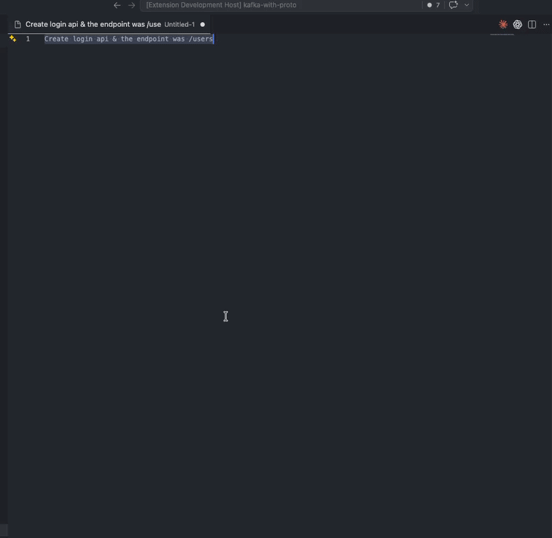
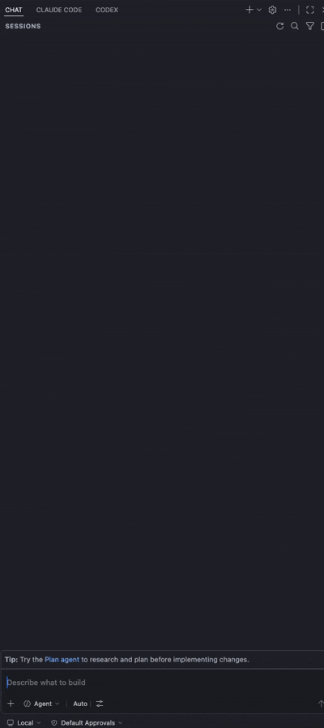

# FixPrompt By AI

**Transform vague prompts into production-ready AI instructions.**

FixPrompt is a VS Code extension that takes your raw, messy developer prompts and enhances them into structured, context-aware AI instructions — automatically injecting your workspace stack, active file context, and best practices.

---

## How It Works

You write a raw prompt. FixPrompt reads your active file, detects your stack, and transforms it into a complete production-ready prompt.

**Before:**
```
create login api
```

**After:**
```
You are a senior backend engineer working in a Next.js + Prisma + TypeScript project.

Goal: Build a POST /api/auth/login endpoint.

Requirements:
- Validate email and password using Zod
- Query user from Prisma with email lookup
- Compare password with bcrypt
- Return signed JWT token on success
- Follow existing API route patterns in the project

Error handling:
- 400 for missing fields
- 401 for invalid credentials
- 500 for unexpected errors

Expected output: Next.js API route handler following the existing patterns in /api routes.
```

---

## Features

- **Workspace-aware** — Detects your framework, language, and dependencies automatically
- **File-aware** — Reads your active file imports and code context around the cursor
- **Multi-LLM** — Works with OpenAI, Groq (free), and Gemini (free)
- **Copilot Chat integration** — Use `@fixprompt` directly in GitHub Copilot Chat
- **Claude integration** — Enhance and send directly to Claude Code
- **Native settings UI** — Configure provider, model, and API key inside VS Code
- **Free tier first** — Groq and Gemini have generous free tiers, no credit card needed

---

## Quick Start

### 1. Install and open Settings

Open Command Palette (`Cmd+Shift+P` / `Ctrl+Shift+P`) → `FixPrompt: Settings`

### 2. Choose your provider and add API key

| Provider | Free Tier | Get Key |
|----------|-----------|---------|
| **Groq** | Yes — fast, generous limits | [console.groq.com](https://console.groq.com) |
| **Gemini** | Yes — rate limited | [aistudio.google.com](https://aistudio.google.com) |
| **OpenAI** | No | [platform.openai.com](https://platform.openai.com) |

> More providers coming soon.

---

## Usage

### Option 1 — Fix prompt in editor

1. Write your raw prompt anywhere in a file
2. Select it
3. Press `Cmd+Shift+F` (Mac) / `Ctrl+Shift+F` (Windows)
4. Enhanced prompt replaces your selection instantly



### Option 2 — Copilot Chat

1. Open Copilot Chat (`Cmd+Alt+I`)
2. Type your raw prompt:
```
@fixprompt create a login API with JWT auth
```
3. FixPrompt enhances and streams the result back in chat
4. No API key needed — uses Copilot's model



### Option 3 — Send to Claude Code

1. Write your raw prompt in any file
2. Select it
3. Command Palette → `FixPrompt: Enhance and Send to Claude`
4. Claude Code panel opens with the enhanced prompt pre-filled

---

## Commands

| Command | Shortcut | Description |
|---------|----------|-------------|
| `FixPrompt: Fix Prompt` | `Cmd+Shift+F` / `Ctrl+Shift+F` | Enhance selected text in editor |
| `FixPrompt: Enhance and Send to Claude` | — | Enhance and open in Claude Code |
| `FixPrompt: Settings` | — | Open settings panel |

---

## Settings

Open via Command Palette → `FixPrompt: Settings`

| Setting | Description |
|---------|-------------|
| Provider | Choose between Groq, Gemini, OpenAI |
| Model | Select from live-fetched models for your provider |
| API Key | Stored securely in VS Code SecretStorage — never on disk |

---

## Context Detection

FixPrompt automatically reads:

- **`package.json`** — framework, dependencies, package manager
- **Active file** — language, imports, code around your cursor
- **Project guidelines** — follows `AGENT.md`, `CONTRIBUTING.md`, `CLAUDE.md` if present
- **Existing patterns** — instructs AI to match your codebase conventions, never invent new ones

---

## Requirements

- VS Code `1.90.0` or higher
- An API key for at least one provider (Groq free tier recommended to start)
- GitHub Copilot (optional — only needed for `@fixprompt` in Copilot Chat)
- Claude Code extension (optional — only needed for Claude integration)

---

## Release Notes

### 0.1.0

Initial release:
- Multi-LLM support: OpenAI, Groq, Gemini
- Workspace and file context detection
- `@fixprompt` Copilot Chat participant
- Claude Code integration
- Native VS Code settings UI with live model fetching
- Free tier model badges

---

## Contributing

Contributions are welcome! See [CONTRIBUTING.md](CONTRIBUTING.md) for guidelines.

## License

MIT

---

## Author

**Hasan Ali Haolader**
- GitHub: [@hasanalihaolader](https://github.com/hasanalihaolader/FixPrompt)
- Email: rahibhasan689009@gmail.com

---

*More LLM providers coming soon. Have a suggestion? [Open an issue](https://github.com/hasanalihaolader/FixPrompt/issues).*
